# 🏥 Sistema de Gerenciamento de Pacientes - Hospital Infantil Sabará

Este é um protótipo de sistema de gerenciamento de pacientes e prontuários médicos desenvolvido como parte da Sprint 4 do curso de Engenharia de Software. O projeto simula um sistema local utilizado para cadastro, consulta, atualização e exclusão de pacientes e seus respectivos prontuários.

## 📌 Objetivo

O sistema tem como objetivo melhorar a **organização dos cadastros e prontuários médicos** de pacientes do Hospital Infantil Sabará, agilizando o atendimento, o acesso à informação e a gestão de dados clínicos de forma segura e simples.

---

## ✅ Funcionalidades

- 📇 **Cadastro de pacientes** com nome, RG, data de nascimento e informações do responsável.
- 🔍 **Busca de pacientes** por RG.
- 📝 **Criação de prontuários médicos**, armazenados como arquivos `.txt` vinculados ao paciente.
- 📂 **Listagem e visualização de prontuários** por data/hora.
- ❌ **Exclusão de pacientes**, com remoção automática dos prontuários relacionados.
- 🧾 **Exclusão individual de prontuários**.
- 📋 **Listagem geral dos cadastros** em formato de tabela.

---

## 🗂 Estrutura de Dados

- `cadastros.json`: Armazena os dados dos pacientes cadastrados.
- `prontuarios.json`: Relaciona RGs de pacientes com os IDs (timestamps) de seus prontuários.
- `*.txt`: Cada prontuário é um arquivo `.txt` com data/hora do atendimento.

---

## 💡 Tecnologias Utilizadas

- Python 3.x
- Módulos nativos: `os`, `json`, `datetime`, `time`

---

## 🔄 Fluxo de Funcionamento (Diagrama)

```mermaid
flowchart TD
    Start[Início] --> Menu[Menu Principal]
    Menu --> Cadastro[Cadastro de Paciente]
    Menu --> Buscar[Buscar Paciente]
    Menu --> NovoProntuario[Novo Prontuário]
    Menu --> BuscarProntuario[Buscar Prontuário]
    Menu --> ExcluirProntuario[Excluir Prontuário]
    Menu --> ExcluirCadastro[Excluir Paciente]
    NovoProntuario --> AtualizaJSON[Atualiza prontuarios.json]
    ExcluirCadastro --> RemoveTXT[Remove arquivos .txt]
    RemoveTXT --> AtualizaJSON2[Atualiza prontuarios.json]
```

